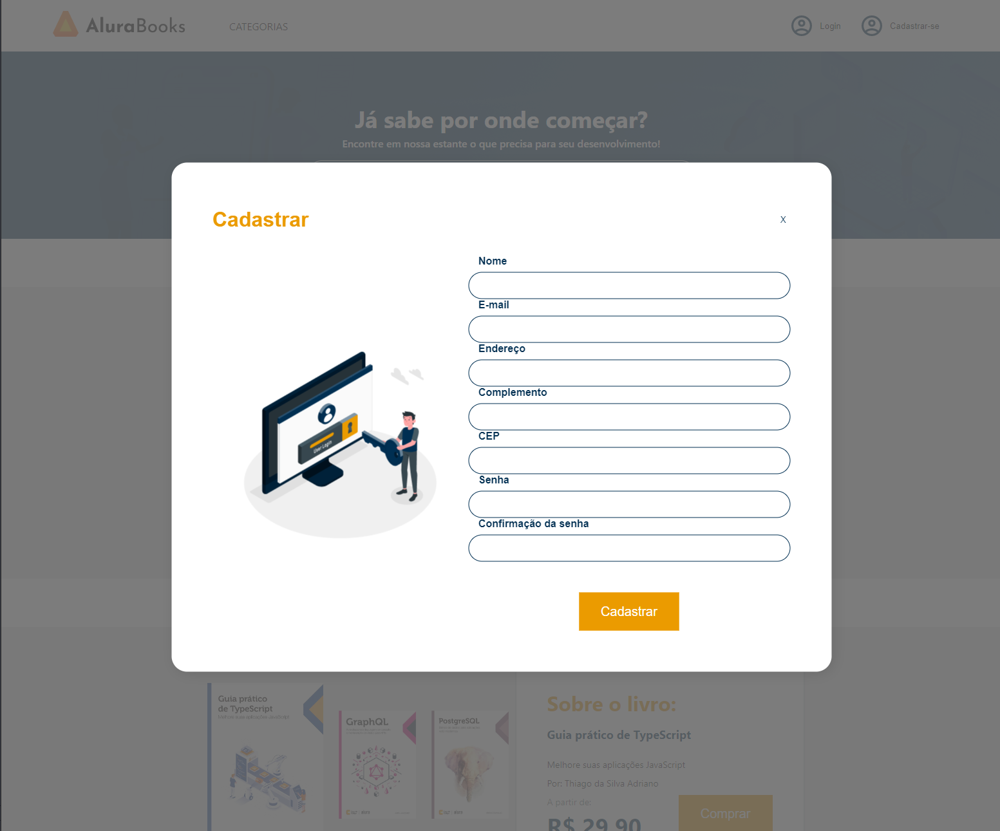

# Formação de React Consumindo APIs na Alura.
 
## Desenvolvimento de um ecommerce em React com Typescript.
### Layout personalizado e responsivo.

1. Design System.
- Aguardando...

2. Autenticando Usuários. 
   1. Conexão com API 
   2. Cadastro e Autenticação de usuários
   3. Autenticando Requisições.
   4. Interceptadores.
   5. Postman
   6. JWT.

